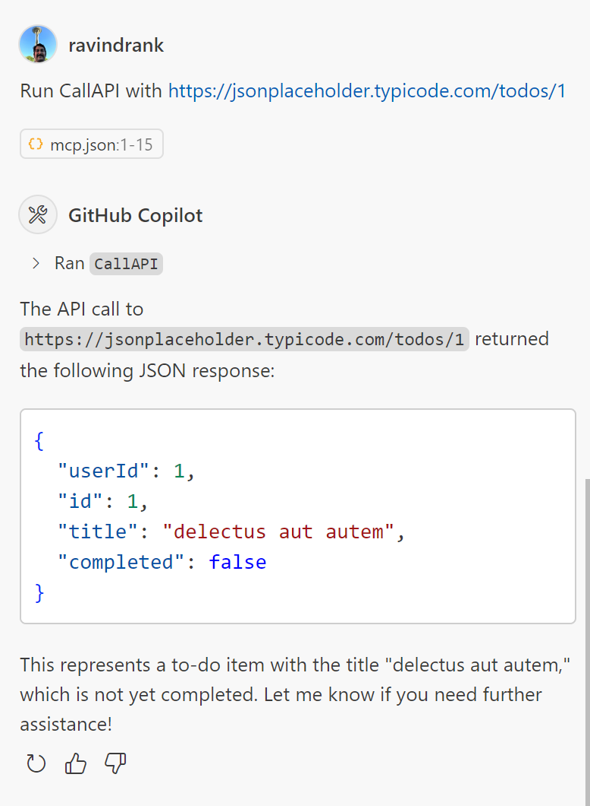

# Generic-MCP

MCP Server to call some generic APIs

Added a quick echo tool from https://devblogs.microsoft.com/dotnet/build-a-model-context-protocol-mcp-server-in-csharp/

Steps to build:

1. dotnet restore
2. dotnet build

3. Create a file mcp.json in your .vscode folder with below contents:
   {
   "inputs": [],
   "servers": {
   "GenericMCP": {
   "type": "stdio",
   "command": "dotnet",
   "args": [
   "run",
   "--project",
   "C:\\full\\path\\GenericMCP\\GenericMCP.csproj"
   ]
   }
   }
   }

4. click start inside your json file to start the tool
5. check in your Github copilot whether Agent mode is enabled and make sure it shows the tool
6. type something like this is chat window:
   Run ReverseEcho with SuuperMCPServer

7. You will be prompted for confirmation post which you should see:

Added CallAPI

